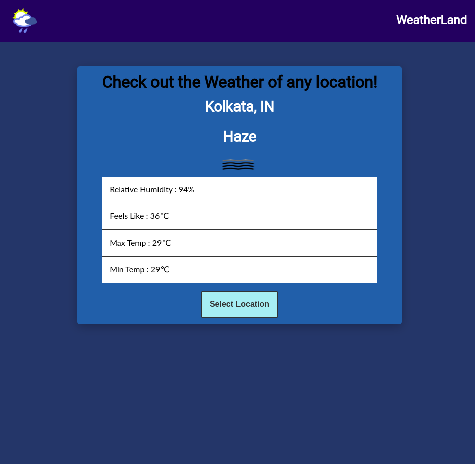
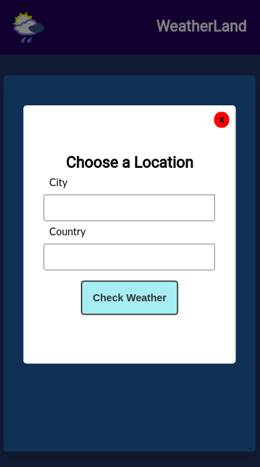

# WeatherApp
Simple Weather App made using HTML5, CSS3, Javascript and the OpenWeatherMap API. Gives dynamic weather data of a location.

# Features
Fetches weather data of a location from the OpenWeatherMap API ( https://openweathermap.org/api ). Fetch API has been used to fetch the data.

# Screenshots

## Normal View

## Responsive View 

# Built with 
1. HTML5
2. CSS3
3. Javascript 

# Live Demo
https://pinkman7009.github.io/WeatherApp/
